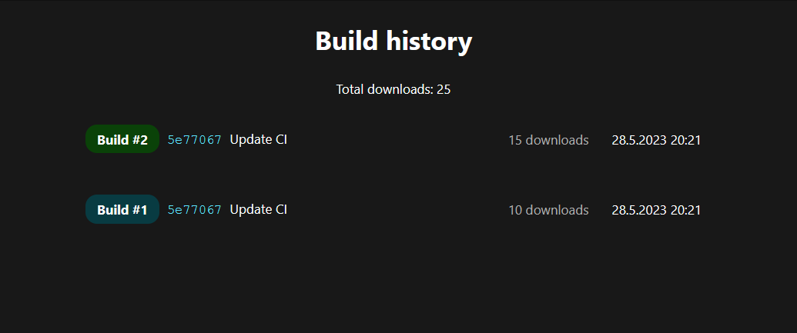

# Buildify WebUI

This is an example web ui for the buildify api.

You can copy this and modify for your needs.

## Project Setup

```sh
npm install
npm install -g serve
```

### Compile and Hot-Reload for Development

```sh
npm run dev
```

### Type-Check, Compile and Minify for Production

```sh
npm run build
cd dist
serve -l [PORT]
```

### Preview

